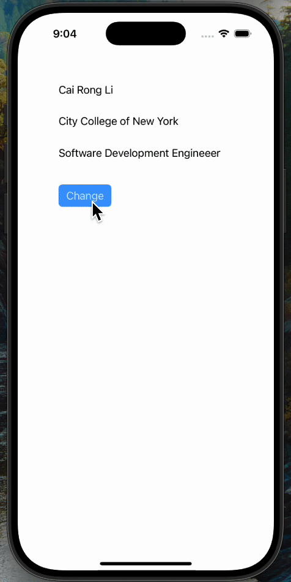

# Prework - *Recipe Roulette*

Submitted by: **Cai Rong Li**

Recipe Roulette is an app designed to inspire culinary creativity while promoting sustainability. Using an intelligent ingredient-based search and an interactive recipe selection system, the app empowers users to discover diverse meal options tailored to their preferences and available ingredients.

Time spent: **1** hour spent in total

## Required Features

The following **required** functionality is completed:

- [x] Users are see a screen with three labels and a button
- [x] Tapping the button changes the screen color to a random color
 
## Video Walkthrough

## App Brainstorming (Step 4)

Spotify:
- Cross-device syncing for seamless music playback for users
- Offline downloads for users to listen to music without the internet

Google Maps:
- Real-time traffic updates
- Explore nearby features

LinkedIn:
- Professional networking
- Job suggestions

## Notes

Describe any challenges encountered while building the app.

- None

## License

    Copyright [2024] [Cai Rong Li]

    Licensed under the Apache License, Version 2.0 (the "License");
    you may not use this file except in compliance with the License.
    You may obtain a copy of the License at

        http://www.apache.org/licenses/LICENSE-2.0

    Unless required by applicable law or agreed to in writing, software
    distributed under the License is distributed on an "AS IS" BASIS,
    WITHOUT WARRANTIES OR CONDITIONS OF ANY KIND, either express or implied.
    See the License for the specific language governing permissions and
    limitations under the License.
